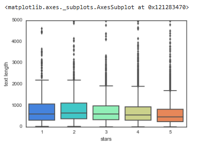
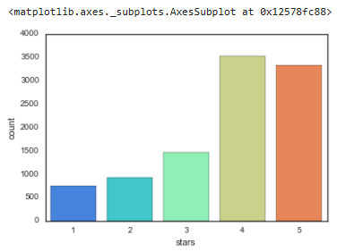
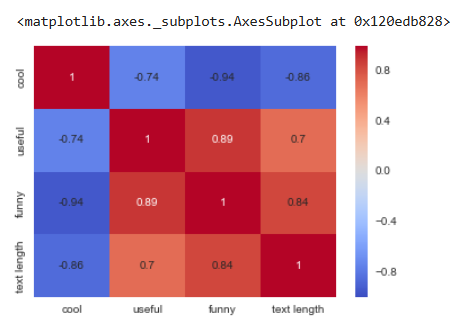

# 🌟 Yelp Review Sentiment Classifier 

Welcome to my NLP Sentiment Analysis Project! This project classifies Yelp reviews into 1-star (negative) or 5-star (positive) categories using text content.

## 📌 Project Overview

### 📋 Objective
- Classify Yelp reviews into binary sentiment categories (1-star vs 5-star)
- Compare NLP preprocessing techniques and ML models
- Implement an efficient classification pipeline

### 🗄️ Dataset
The [Yelp Review Dataset](https://www.kaggle.com/datasets/yelp-dataset/yelp-dataset) contains:
- `stars`: Rating (1-5)
- `text`: Review content
- `cool/useful/funny`: User votes

> **Note**: Only 1-star and 5-star reviews were used for binary classification

## 📊 Exploratory Data Analysis

### Review Length Distribution

*Distribution of text length across different star ratings*

### Rating Distribution

*Count of reviews per star rating*

### Feature Correlations

*Correlation matrix between different features*

### Text Length vs Rating

*Relationship between text length and star ratings*

## 🛠 Tech Stack
| Category        | Tools                          |
|-----------------|--------------------------------|
| Core Language   | Python 3.x                     |
| NLP Processing  | NLTK, SpaCy                    |
| ML Framework    | Scikit-Learn                   |
| Data Handling   | Pandas, NumPy                  |
| Visualization   | Matplotlib, Seaborn            |

## 🔍 Implementation

### 2️⃣ Model Performance
**Without Text Processing**

Confusion matrix and classification report

**With Text Processing**

Improved results after text processing

## #🚀 Getting Started
### Prerequisites

Python 3.8+
VS Code with Python extension
Jupyter Notebook (optional)

### Installation

git clone https://github.com/safikasi/NLP-Project.git

cd NLP-Project

pip install -r requirements.txt

## 🌐 Connect With Me
**Safwan Khan Kasi**  
DS & ML Enthusiast   

